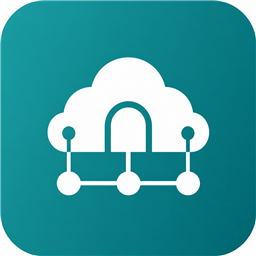

# JamfDotNet

Developer-friendly .NET libraries for Jamf APIs.

Each packable project targets **`net8.0` and `net10.0`** in a single NuGet package (`lib/net8.0` + `lib/net10.0`), includes XML documentation for IntelliSense, and ships a package-specific README.

| | Package | Description |
|---|---------|-------------|
|  | `JamfDotNet.Core` | Shared options, authentication, exceptions, and DI helpers |
|  | `JamfDotNet.Pro` | Strongly typed Jamf Pro API client (Kiota-generated) |
|  | `JamfDotNet.Classic` | Strongly typed Classic API client (`/JSSResource`, Kiota-generated) |
|  | `JamfDotNet.Platform` | Jamf Platform API Gateway (blueprints, devices, compliance, …) |
|  | `JamfDotNet.Protect` | Typed Jamf Protect GraphQL client |
|  | `JamfDotNet.School` | Jamf School REST client (Basic + protocol version) |
|  | `JamfDotNet.TitleEditor` | Title Editor API client (Kiota, bearer + keepalive) |

## Requirements

- .NET 8.0 or .NET 10.0

## Quick start (Jamf Pro + OAuth2)

```csharp
using JamfDotNet.Core;
using JamfDotNet.Pro;
using Microsoft.Extensions.DependencyInjection;

var services = new ServiceCollection();
services.AddJamfProClient(options =>
{
    options.BaseUrl = new Uri("https://your.jamfcloud.com");
    options.ClientId = Environment.GetEnvironmentVariable("JAMF_CLIENT_ID")!;
    options.ClientSecret = Environment.GetEnvironmentVariable("JAMF_CLIENT_SECRET")!;
});

await using var provider = services.BuildServiceProvider();
var jamf = provider.GetRequiredService<JamfProClient>();

var inventory = await jamf.Api.V1.ComputersInventory.GetAsync(config =>
{
    config.QueryParameters.Page = 0;
    config.QueryParameters.PageSize = 100;
});
```

## Quick start (Classic API)

```csharp
using JamfDotNet.Classic;
using Microsoft.Extensions.DependencyInjection;

var services = new ServiceCollection();
services.AddJamfClassicClient(options =>
{
    options.BaseUrl = new Uri("https://your.jamfcloud.com");
    options.ClientId = Environment.GetEnvironmentVariable("JAMF_CLIENT_ID")!;
    options.ClientSecret = Environment.GetEnvironmentVariable("JAMF_CLIENT_SECRET")!;
});

await using var provider = services.BuildServiceProvider();
var classic = provider.GetRequiredService<JamfClassicClient>();

var buildings = await classic.Api.Buildings.GetAsync();
var computer = await classic.Api.Computers.Id[1].GetAsync();
```

## Quick start (Platform Gateway)

```csharp
services.AddJamfPlatformClient(o =>
{
    o.GatewayBaseUrl = new Uri("https://us.apigw.jamf.com");
    o.ClientId = "...";
    o.ClientSecret = "...";
    o.TenantId = "...";
});
var platform = provider.GetRequiredService<JamfPlatformClient>();
```

## Quick start (Protect GraphQL)

```csharp
services.AddJamfProtectClient(o =>
{
    o.BaseUrl = new Uri("https://your.protect.jamfcloud.com");
    o.ClientId = "...";
    o.ClientSecret = "...";
});
var protect = provider.GetRequiredService<JamfProtectClient>();
var roles = await protect.ListRolesAsync();
using var raw = await protect.ExecuteAsync(query, variables);
```

> **Note:** Protect GraphQL (`JamfDotNet.Protect`) is not the same as Jamf Pro `/v1/jamf-protect` registration endpoints.

## Quick start (School)

```csharp
services.AddJamfSchoolClient(o =>
{
    o.BaseUrl = new Uri("https://your.jamfcloud.com");
    o.NetworkId = "...";
    o.ApiKey = "...";
    o.ProtocolVersion = "3";
});
var school = provider.GetRequiredService<JamfSchoolClient>();
var devices = await school.Devices.ListAsync();
```

## Quick start (Title Editor)

```csharp
services.AddJamfTitleEditorClient(o =>
{
    o.BaseUrl = new Uri("https://your.appcatalog.jamfcloud.com");
    o.Username = "...";
    o.Password = "...";
});
var titles = provider.GetRequiredService<JamfTitleEditorClient>();
var list = await titles.Api.Softwaretitles.GetAsync();
```

> Classic create/update operations generally require XML bodies. Prefer the Jamf Pro API for new work when an equivalent endpoint exists.

## OpenAPI & code generation

Clients are generated with [Kiota](https://learn.microsoft.com/openapi/kiota/) where OpenAPI is available.

| API | Schema source | Scripts |
|-----|---------------|---------|
| Pro | `openapi/jamf-pro.schema.json` | `Fetch-JamfProSchema.ps1`, `Generate-JamfProClient.ps1` |
| Classic | `openapi/jamf-classic.swagger.yaml` | `Fetch-JamfClassicSchema.ps1`, `Generate-JamfClassicClient.ps1` |
| Platform | `openapi/platform/*.json` | `Fetch-JamfPlatformSpecs.ps1`, `Generate-JamfPlatformClient.ps1` |
| Title Editor | `openapi/jamf-title-editor.schema.json` | `Assemble-JamfTitleEditorSchema.ps1` / `Fetch-JamfTitleEditorSchema.ps1`, `Generate-JamfTitleEditorClient.ps1` |
| Protect | `graphql/jamf-protect.schema.graphql` (hand-typed client) | — |
| School | Optional OpenAPI via `Fetch-JamfSchoolSchema.ps1` (hand-written client) | `Fetch-JamfSchoolSchema.ps1` |

```powershell
./scripts/Fetch-JamfProSchema.ps1
./scripts/Generate-JamfProClient.ps1

./scripts/Fetch-JamfClassicSchema.ps1
./scripts/Generate-JamfClassicClient.ps1

./scripts/Fetch-JamfPlatformSpecs.ps1
./scripts/Generate-JamfPlatformClient.ps1

./scripts/Assemble-JamfTitleEditorSchema.ps1
./scripts/Generate-JamfTitleEditorClient.ps1
```

## Authentication

| Package | Auth |
|---------|------|
| Pro / Classic | OAuth2 client credentials or Basic → bearer |
| Platform | OAuth2 client credentials against `*.apigw.jamf.com` |
| Protect | OAuth2 (`client_id` + `password`) → GraphQL at `{base}/app` |
| School | Basic (`NetworkId`:`ApiKey`) + `X-Server-Protocol-Version` |
| Title Editor | Basic → bearer (`/v2/auth/token`) with keepalive (~15 min TTL) |

## Live smoke tests

Unit tests always run. Live smoke tests no-op unless environment variables are set:

| Package | Variables |
|---------|-----------|
| Pro / Classic | `JAMF_URL`, `JAMF_CLIENT_ID`, `JAMF_CLIENT_SECRET` |
| Platform | `JAMF_PLATFORM_URL`, `JAMF_PLATFORM_CLIENT_ID`, `JAMF_PLATFORM_CLIENT_SECRET`, `JAMF_PLATFORM_TENANT_ID` |
| Protect | `JAMF_PROTECT_URL`, `JAMF_PROTECT_CLIENT_ID`, `JAMF_PROTECT_CLIENT_SECRET` |
| School | `JAMF_SCHOOL_URL`, `JAMF_SCHOOL_NETWORK_ID`, `JAMF_SCHOOL_API_KEY` |
| Title Editor | `JAMF_TITLE_EDITOR_URL`, `JAMF_TITLE_EDITOR_USERNAME`, `JAMF_TITLE_EDITOR_PASSWORD` |

Schema fetch scripts may also use `JAMF_SCHOOL_URL`, `JAMF_TITLE_EDITOR_URL`, `JAMF_SCHEMA_URL`, `JAMF_BEARER_TOKEN`, `JAMF_CLASSIC_SCHEMA_URL`.

## Building

```powershell
dotnet restore JamfDotNet.slnx
dotnet build JamfDotNet.slnx -c Release
dotnet test JamfDotNet.slnx -c Release
dotnet pack JamfDotNet.slnx -c Release
```

See [AGENTS.md](AGENTS.md) and [CONTRIBUTING.md](CONTRIBUTING.md) for contributor workflows (including XML documentation requirements).

## Publishing to NuGet.org

CI publishes packages when:

1. A GitHub Release is published (tag `v0.1.0` → version `0.1.0`), or
2. The **Publish NuGet** workflow is run manually (`workflow_dispatch`).

Required repository secret:

- `NUGET_API_KEY` — API key from [nuget.org](https://www.nuget.org/account/apikeys) (push scope for `JamfDotNet.*`)

Optional GitHub Environment named `nuget` can add approval gates before publish.

## License

MIT — see [LICENSE](LICENSE).
